# Tutorial 10: Observability and Debugging

> Trace every step. Visualize reasoning. Propagate correlation IDs across agents. Aggregate errors. Fire alerts. See your agent the way it sees itself.

Agent systems are harder to debug than traditional services. A single user request can fan out across 5 agents, 20 tool calls, 3 LLM providers, 2 vector stores, and a dozen guardrail checks. Logs alone will not save you. You need **traces**, **metrics**, and **structured events**.

Argentor instruments all of this and exposes it in industry-standard formats (OpenTelemetry, Prometheus, JSON traces, Mermaid).

---

## Prerequisites

- Completed earlier tutorials (especially [Tutorial 7: Agent Intelligence](./07-agent-intelligence.md))
- Docker (for running Jaeger / OTel Collector locally)
- Basic familiarity with distributed tracing concepts

---

## 1. Enable the Debug Recorder

The debug recorder captures a step-by-step trace of everything the agent did: user input, thinking passes, tool calls, LLM responses, compaction, checkpoints, final output.

```rust
use argentor_agent::AgentRunner;

let runner = AgentRunner::new(config, skills, permissions, audit)
    .with_debug_recorder("request-abc-123")
    .with_intelligence();

let mut session = Session::new();
let response = runner.run(&mut session, "Research X and summarize").await?;

// Finalize and dump the trace
let trace = runner.debug_recorder().finalize();
let json = serde_json::to_string_pretty(&trace)?;
std::fs::write("./trace.json", json)?;
```

A `DebugTrace` looks like:

```json
{
  "trace_id": "request-abc-123",
  "started_at": "2026-04-11T10:22:15Z",
  "finished_at": "2026-04-11T10:22:42Z",
  "duration_ms": 27_412,
  "steps": [
    {"step_type":"Input","content":"Research X and summarize","timestamp":...},
    {"step_type":"Thinking","content":"confidence=0.85, subtasks=3","timestamp":...},
    {"step_type":"ToolCall","content":"web_search({\"query\":\"X\"})","timestamp":...},
    {"step_type":"ToolResult","content":"Found 5 results","timestamp":...},
    {"step_type":"LlmRequest","content":"...","timestamp":...},
    {"step_type":"LlmResponse","content":"...","timestamp":...},
    {"step_type":"Custom(\"tool_discovery\")","content":"8/50 tools selected","timestamp":...},
    {"step_type":"Output","content":"X is...","timestamp":...}
  ],
  "summary": {
    "total_steps": 14,
    "tool_calls": 3,
    "llm_calls": 4,
    "total_tokens": 8_412,
    "estimated_cost_usd": 0.0128
  }
}
```

---

## 2. Visualize Traces

### 2.1 Mermaid gantt chart

```rust
use argentor_agent::debug_recorder::DebugRecorder;

let mermaid = trace.to_mermaid_gantt();
std::fs::write("./trace.mmd", &mermaid)?;
// Render with `mmdc -i trace.mmd -o trace.svg` (mermaid-cli)
```

Output:

```mermaid
gantt
  title Agent Trace: request-abc-123
  dateFormat  X
  axisFormat %S.%L s

  section Turn 1
  Input: 0, 10
  Thinking: 10, 890
  ToolCall web_search: 900, 1420
  LlmRequest: 1425, 2840

  section Turn 2
  ToolCall http_fetch: 2841, 3280
  LlmRequest: 3285, 4610
  Output: 4611, 4612
```



### 2.2 Flame graph

```rust
let flame = trace.to_flamegraph();
std::fs::write("./trace.folded", &flame)?;
// Render with `flamegraph.pl trace.folded > trace.svg`
```

Gives you the classic latency-per-step stacked view.

### 2.3 TraceViz JSON

Native format consumed by Argentor's dashboard at `/dashboard/traces`:

```rust
let viz = serde_json::to_string_pretty(&trace.to_traceviz())?;
std::fs::write("./traceviz.json", viz)?;
```

---

## 3. OpenTelemetry Integration

Wire Argentor into your existing OTel stack:

```toml
# Cargo.toml
argentor-core = { git = "...", branch = "master", features = ["telemetry"] }
```

```rust
use argentor_core::telemetry::{init_telemetry, shutdown_telemetry, TelemetryConfig};

#[tokio::main]
async fn main() -> anyhow::Result<()> {
    // Initialize OTLP exporter
    let telemetry_config = TelemetryConfig {
        enabled: true,
        otlp_endpoint: "http://localhost:4317".into(),
        service_name: "argentor-prod".into(),
        sample_rate: 1.0,  // 100% for dev; 0.1 for prod
    };
    init_telemetry(&telemetry_config)?;

    // ... run your agent ...

    shutdown_telemetry();
    Ok(())
}
```

Every `AgentRunner::run`, tool call, and LLM request is a span with `#[tracing::instrument]`. Spans carry attributes:

- `session_id`
- `tool.name`, `tool.args_hash`, `tool.outcome`
- `llm.provider`, `llm.model`, `llm.tokens_in`, `llm.tokens_out`, `llm.cost_usd`
- `agent.role`, `agent.turn`

### Run Jaeger locally

```bash
docker run -d --name jaeger \
  -p 16686:16686 \
  -p 4317:4317 \
  jaegertracing/all-in-one:latest
```

Set `otlp_endpoint = "http://localhost:4317"` in Argentor, then browse to `http://localhost:16686` to see traces.

### Run the OTel Collector

For production, deploy the OpenTelemetry Collector and fan out to your APM (Datadog, Honeycomb, Grafana Tempo):

```yaml
# otel-config.yaml
receivers:
  otlp:
    protocols: { grpc: {}, http: {} }
exporters:
  otlp/datadog:
    endpoint: "https://trace.agent.datadoghq.com"
    headers: { DD-API-KEY: "${DD_API_KEY}" }
  otlp/tempo:
    endpoint: "tempo:4317"
    tls: { insecure: true }
service:
  pipelines:
    traces:
      receivers: [otlp]
      exporters: [otlp/datadog, otlp/tempo]
```

---

## 4. Correlation Context Propagation

When a request flows across agents, skills, and MCP backends, you need a **correlation ID** threaded through everything.

Argentor uses W3C Trace Context (`traceparent` header) automatically when the `telemetry` feature is on. Extract and propagate manually in custom code:

```rust
use argentor_core::correlation::{CorrelationContext, Baggage};

// On the inbound edge (HTTP handler, Slack webhook, etc.)
let ctx = CorrelationContext::from_headers(&request_headers);

// Pass to AgentRunner — every span emitted inherits the trace ID
let runner = AgentRunner::new(config, skills, permissions, audit)
    .with_correlation(ctx.clone());

// Inside a custom skill, read the current context
let current = CorrelationContext::current();
println!("Handling request {} trace_id={}",
    current.request_id, current.trace_id);

// Pass to a downstream HTTP call
let mut headers = reqwest::header::HeaderMap::new();
current.inject_headers(&mut headers);
reqwest::Client::new().get("http://internal-api/").headers(headers).send().await?;
```

Baggage (custom key-value pairs) rides along too:

```rust
let ctx = ctx.with_baggage("tenant_id", "acme-corp")
             .with_baggage("experiment", "variant-b");
```

Every downstream span gets `tenant_id=acme-corp`, `experiment=variant-b` as attributes.

---

## 5. Error Aggregation

Production generates thousands of errors. Raw logs are unreadable. `ErrorAggregator` fingerprints and dedups:

```rust
use argentor_core::error_aggregator::{ErrorAggregator, ErrorCategory, ErrorSeverity};

let aggregator = ErrorAggregator::default();

// Record an error
aggregator.record(
    "llm_timeout",
    ErrorCategory::LlmProvider,
    ErrorSeverity::High,
    "OpenAI request timed out after 30s",
    Some(serde_json::json!({"provider": "openai", "model": "gpt-4o"})),
);

// Query error groups
let groups = aggregator.groups();
for g in groups {
    println!(
        "[{:?}] {} ({} occurrences, last {} ago)",
        g.severity, g.fingerprint, g.count,
        humantime::format_duration(g.last_seen.elapsed().unwrap()),
    );
}

// Trend analysis — are errors increasing?
let trend = aggregator.trend_for_fingerprint("llm_timeout",
    std::time::Duration::from_hours(1));
// Returns: Rising | Stable | Falling | New
```

The orchestrator wires this in automatically. Query from any workflow:

```rust
let orchestrator = Orchestrator::new(&config, skills, permissions, audit);
let agg = orchestrator.error_aggregator();
```

---

## 6. Alert Engine

Trigger alerts when things go wrong. `AlertEngine` supports 8 condition types:

```rust
use argentor_security::alerts::{AlertCondition, AlertEngine, AlertRule, AlertSeverity};

let engine = AlertEngine::new();

// High error rate
engine.register_rule(AlertRule {
    name: "llm_error_rate".into(),
    condition: AlertCondition::ErrorRateAbove { threshold_pct: 5.0, window_secs: 300 },
    severity: AlertSeverity::Critical,
    cooldown_secs: 600,
    message_template: "LLM error rate exceeded 5% in last 5min".into(),
});

// Cost budget exceeded
engine.register_rule(AlertRule {
    name: "daily_cost".into(),
    condition: AlertCondition::MetricAbove {
        metric: "argentor_cost_usd_total".into(),
        threshold: 50.0,
        window_secs: 86_400,
    },
    severity: AlertSeverity::Warning,
    cooldown_secs: 3600,
    message_template: "Daily LLM spend exceeded $50".into(),
});

// p99 latency spike
engine.register_rule(AlertRule {
    name: "slow_responses".into(),
    condition: AlertCondition::LatencyP99Above { threshold_ms: 15_000, window_secs: 60 },
    severity: AlertSeverity::High,
    cooldown_secs: 300,
    message_template: "p99 latency >15s — investigate".into(),
});

// Evaluate every 60s
let evaluation = engine.evaluate().await;
for alert in evaluation.triggered {
    println!("ALERT: {}", alert.message);
    // Send to PagerDuty, Slack, Opsgenie, etc.
}
```

Wire up to your paging system:

```rust
for alert in evaluation.triggered {
    reqwest::Client::new()
        .post("https://events.pagerduty.com/v2/enqueue")
        .json(&serde_json::json!({
            "routing_key": "...",
            "event_action": "trigger",
            "payload": {
                "summary": alert.message,
                "severity": format!("{:?}", alert.severity).to_lowercase(),
                "source": "argentor",
            }
        }))
        .send().await?;
}
```

---

## 7. SLA Tracker

Track uptime, error rate, and incident lifecycle:

```rust
use argentor_security::sla::SlaTracker;

let tracker = SlaTracker::new();

// Record an incident
let incident_id = tracker.open_incident(
    "LLM provider outage",
    "OpenAI 502 errors",
    SlaSeverity::High,
).await?;

// ... later ...
tracker.resolve_incident(incident_id, "Switched to Claude fallback").await?;

// Query SLA metrics
let report = tracker.compliance_report(
    std::time::Duration::from_days(30)
).await;
println!("Uptime: {:.3}%", report.uptime_pct);
println!("Response time compliance: {:.1}%", report.response_time_compliance_pct);
println!("Incidents: {}", report.incident_count);
```

---

## 8. Metrics Export Formats

Beyond `/metrics` (Prometheus), Argentor can export to:

- **JSON** — `/api/v1/metrics?format=json`
- **CSV** — `/api/v1/metrics?format=csv`
- **OpenMetrics** — `/metrics?format=openmetrics` (Prometheus + type/unit metadata)
- **InfluxDB Line Protocol** — `/api/v1/metrics?format=influx`

In code:

```rust
use argentor_core::metrics_export::{MetricsExporter, ExportFormat};

let exporter = MetricsExporter::new();
let snapshot = exporter.snapshot().await;

let json = snapshot.to_json()?;
let csv = snapshot.to_csv();
let influx = snapshot.to_influx_line_protocol();

std::fs::write("./metrics.json", json)?;
```

Useful for batch exports to data warehouses:

```bash
# Cron: export nightly to S3
argentor-cli metrics export --format influx | \
  aws s3 cp - s3://my-bucket/argentor/metrics-$(date +%F).influx
```

---

## 9. Debugging Workflow

When something breaks in production:

**Step 1** — Pull the trace by request ID from Jaeger / Tempo:

```bash
curl "http://jaeger:16686/api/traces?service=argentor-prod&tags=request_id=abc-123"
```

**Step 2** — Fetch the debug recorder JSON (if you enabled `.with_debug_recorder()`):

```rust
// If you persist traces to disk
let trace: DebugTrace = serde_json::from_reader(
    std::fs::File::open("./traces/abc-123.json")?
)?;
```

**Step 3** — Inspect the audit log for denials and errors:

```rust
use argentor_security::{query_audit_log, AuditFilter};

let result = query_audit_log(&log_path, &AuditFilter {
    session_id: Some(session_id),
    ..Default::default()
})?;
```

**Step 4** — Check the error aggregator for related occurrences:

```rust
let related = error_aggregator.groups_by_fingerprint_prefix("llm_timeout");
```

**Step 5** — Replay with `CheckpointManager`:

```rust
// If the agent was running with checkpointing enabled, rewind
let mgr = runner.checkpoint_manager_mut().unwrap();
let session = mgr.restore(checkpoint_id).await?;
// Now re-run with verbose logging
```

---

## 10. Event Bus for Custom Subscribers

Subscribe to internal events programmatically:

```rust
use argentor_core::event_bus::{Event, EventBus};

let bus = orchestrator.event_bus();

// Subscribe to all events
let mut rx = bus.subscribe();

tokio::spawn(async move {
    while let Ok(event) = rx.recv().await {
        match event {
            Event::TaskStarted { role, task_id } => {
                println!("task {task_id} picked up by {role:?}");
            }
            Event::TaskCompleted { role, task_id, .. } => {
                println!("task {task_id} done");
            }
            Event::ToolCallFailed { skill, error } => {
                eprintln!("tool {skill} failed: {error}");
            }
            _ => {}
        }
    }
});
```

Forward events to Kafka, RabbitMQ, or any message queue for downstream analytics.

---

## Common Issues

**Traces not showing up in Jaeger**
Verify the OTLP endpoint reachable from the pod: `kubectl exec argentor-0 -- curl -v http://jaeger:4317`. Port `4317` is gRPC; for HTTP use `4318`.

**Sampling at 100% breaking the collector**
OpenTelemetry Collector can bottleneck on high-cardinality traces. Drop `sample_rate` to 0.1 for prod, or configure tail-based sampling in the collector.

**`traceparent` header missing**
Your ingress does not propagate W3C headers. Configure your load balancer (AWS ALB, Nginx, Envoy) to forward `traceparent` and `tracestate`.

**Metrics cardinality explosion**
Avoid putting unbounded values (user IDs, full URLs) in label dimensions. Argentor's built-in metrics are safe, but custom `MetricsCollectorSkill` usage can blow up.

**Alert fatigue**
Set `cooldown_secs` high enough to avoid spamming. Prefer `ErrorRateAbove` over `ErrorCountAbove` (rates self-normalize as traffic grows).

**Audit log growing faster than disk**
Enable rotation in `argentor.toml` (`audit.rotate_daily = true`, `audit.max_size_mb = 500`) and ship logs to S3 / Loki / Splunk.

---

## What You Built

- Step-by-step debug traces with Mermaid, flame graph, and TraceViz output
- OpenTelemetry-compatible distributed tracing across agents, tools, and LLM calls
- W3C traceparent propagation with custom baggage
- Error aggregation with fingerprinting and trend analysis
- Alert engine with PagerDuty-ready integration
- SLA tracker for uptime and incident lifecycle
- Multi-format metrics export (JSON, CSV, OpenMetrics, InfluxDB)
- Event bus for custom downstream analytics

---

## Next Steps

- **[Tutorial 9: Production Deployment](./09-deployment.md)** — wire the metrics and traces into your actual infra.
- **[Tutorial 7: Agent Intelligence](./07-agent-intelligence.md)** — combine observability with adaptive behaviors.
- **[GETTING_STARTED.md](../GETTING_STARTED.md)** — return to the main guide.

You have now seen every major subsystem of Argentor. Go build something.
